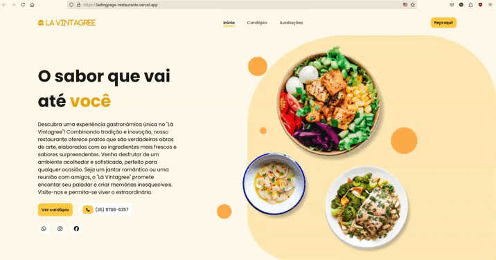

# Landing Page Moderna e Responsiva

Uma landing page projetada para converter visitantes em clientes, apresentando seu produto, serviço ou aplicativo de forma envolvente.





## Funcionalidades

- **Design Atraente**: Layout moderno com animações suaves.
- **Responsividade**: Compatível com diversos dispositivos e tamanhos de tela.
- **SEO Otimizado**: Melhores práticas para otimização em mecanismos de busca.
- **Fácil Customização**: Estrutura de código organizada para personalizações rápidas.
- **Seções Inclusas**:
  - Destaques do produto/serviço.
  - Depoimentos de clientes.
  - Planos de preços.
  - Formulário de contato integrado.

## Tecnologias Utilizadas

- **HTML5**: Estruturação semântica do conteúdo.
- **CSS3**: Estilização e layout responsivo.
- **JavaScript**: Interatividade e funcionalidades dinâmicas.

## Visualização

Acesse a página ao vivo: [Landing Page](https://ladingpage-restaurante.vercel.app)

## Como Utilizar

1. **Clone o repositório**:

   ```bash
   git clone https://github.com/MartinesEmanuel/LadingPage.git
